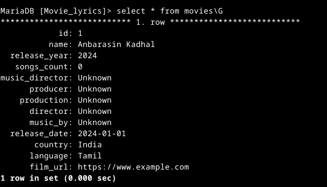
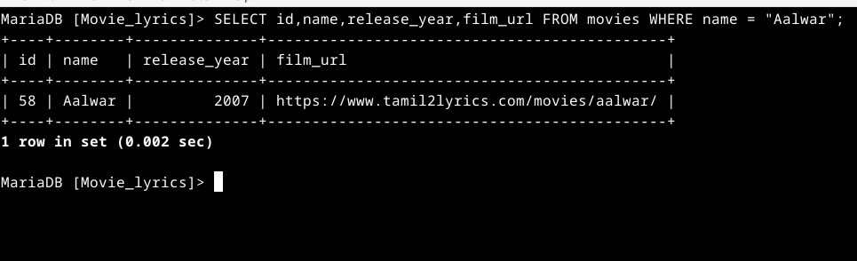

Disclaimer:

This project is intended solely for educational purposes. The materials, code, and information provided within this project are designed to help individuals learn and understand various technical concepts and should not be used in a production environment without further modification and testing.


--------------------

Site: https://www.tamil2lyrics.com

This Git repository downloads all Tamil film lyrics. 

The lyrics are downloaded into folders named after each movie, and the song lyrics are saved in HTML format.


## Update_info

| DATE | Films |  Pages (lastpage_films) | Site_lyrics_counts |  Update or not  | Update | archive_files |
| --- |  --- | :---: | :---: | :---: |  :---: | :---: |
| 1 October 2024 | 4048 |271 (11) | 18128 song lyrics   | [✓]  | 4048 | <table border="0"><tr><td><a href="archive/movies_Lyrics_archive.zip" target="_blank">movies_Lyrics_archive.zip</a></td></tr><tr><td><a href="archive/movies_Lyrics_archive.z01" target="_blank">movies_Lyrics_archive.z01</a></td></tr><tr><td><a href="archive/movies_Lyrics_archive.z02" target="_blank">movies_Lyrics_archive.z02</a></td></tr><tr><td><a href="archive/movies_Lyrics_archive_index.txt" target="_blank">movies_Lyrics_archive_index</a></td></tr></table> |
| 14 October 2024 | 4093 |273 (13) | 18365 song lyrics  | [✓]  | 46 | <table border="0"><tr><td><a href="archive/46_films_archive_index.zip" target="_blank">46_films_archive_index.zip</a></td></tr><tr><td><a href="archive/46_films_archive_index.txt" target="_blank">movies_Lyrics_archive_index</a></td></tr></table> |


--------------------

How to Use This Code

--------------------
Step 1: Set Up a Python Virtual Environment

Before running the code, it's a good practice to create a virtual environment. This isolates your project and ensures that dependencies do not conflict with other projects.

```
python3 -m venv mysite
source mysite/bin/activate
```

Step 2: Clone My GitHub Repository

Clone the repository to your local machine using the following command:

```
git clone "https://github.com/Tpj-root/site_cloner.git"
```

Step 3: Install the Required Dependencies

Navigate to the project directory and install the required dependencies:

```
pip install -r requirements.txt
```

Step 4: Run the Code

```
python3 main_2.py
```


Step 5: Run the Code lyrics to txt

```
bash lyrics_html2txt.sh
```

-------------------------

note:
main_1.py — This code is used to generate and collect all the film URLs.


-------------------------

Time Required for Runtime

For python3 main_1.py:

    The code processes 270 pages per URL request, and each request takes 10 seconds. 
    Therefore, the total runtime required is approximately 45 minutes. 
    The code has already been run to collect all the film URLs in movie_urls.txt.
    

For python3 main_2.py:

    The command cat movie_urls.txt | wc -l shows that there are approximately 4048 films.
    The total runtime required to download all the movie lyrics is approximately 11+ hours.
    (4048 * 10 ) / (60 * 60) = 11.24 hr


For python3 html2txt.py

    Usage: python3 html2txt.py <inputfile.html> <outputfile.txt>
    
    Function: Reads the HTML content from input_file, parses it with BeautifulSoup,
    extracts the plain text, and writes it to output_file.


For bash lyrics_html2txt.sh

    The Bash script:

    - Finds the movies_sample folder.
    - Recursively reads the movie names.
    - Then reads the names of the HTML lyric files.
    - Finds each HTML file and automatically runs the Python script to convert <filename.html> into <filename.html.txt>.


For bash ignore.sh <inputfile.txt> <outputfile.txt>

    - added some data cleaning bash script


For unzip tool will automatically handle the split files and extract the content

Ensure all the parts (.zip, .z01, .z02, etc.) are in the same directory before running the command.
    
```
unzip movies_Lyrics_archive.zip


```


-------------------------


# MySQL

mysql is a relational database management system (RDBMS) that is primarily used to store, manage, and query data.

## Install

```
sudo apt install default-mysql-server
```

## run
```
sudo mysql
```

-- Step 1: Create the database
```
CREATE DATABASE Movie_lyrics;
```


-- Step 2: Use the database
```
USE Movie_lyrics;
```

-- Step 3: Create the movies table

```
CREATE TABLE movies (
    id INT AUTO_INCREMENT PRIMARY KEY,
    name VARCHAR(255) NOT NULL,
    release_year YEAR NOT NULL DEFAULT 2024, -- Default release year
    songs_count INT DEFAULT 0,               -- Default song count
    music_director VARCHAR(255) DEFAULT 'Unknown',  -- Default music director
    producer VARCHAR(255) DEFAULT 'Unknown',        -- Default producer
    production VARCHAR(255) DEFAULT 'Unknown',      -- Default production house
    director VARCHAR(255) DEFAULT 'Unknown',        -- Default director
    music_by VARCHAR(255) DEFAULT 'Unknown',        -- Default for music_by
    release_date DATE DEFAULT '2024-01-01',         -- Default release date
    country VARCHAR(100) DEFAULT 'India',           -- Default country
    language VARCHAR(100) DEFAULT 'Tamil',          -- Default language
    film_url VARCHAR(255) DEFAULT 'https://www.example.com' -- Default URL
);
```

If you insert data without specifying these values, the default ones will be used:

```
INSERT INTO movies (name)
VALUES ('Anbarasin Kadhal');
```


-- Step 4: Create the songs table

```
CREATE TABLE songs (
    id INT AUTO_INCREMENT PRIMARY KEY,
    movie_id INT,
    title VARCHAR(255) NOT NULL,
    lyrics TEXT,
    singer VARCHAR(255),
    FOREIGN KEY (movie_id) REFERENCES movies(id)
);
```

----  view list all tables

```
SHOW TABLES;
```


Example: Updating a Movie's Details

If you want to update the songs_count and producer for a specific movie later:

```
UPDATE movies
SET songs_count = 7, producer = 'New Producer'
WHERE name = 'Anbarasin Kadhal';
```


Example: Updating the URL for a Movie

If you want to update the film_url later:

```
UPDATE movies
SET film_url = 'https://www.tamil2lyrics.com/movies/100/'
WHERE name = 'Anbarasin Kadhal';
```


## If you want to delete the movies table, use the following command:

```
DROP TABLE movies;
```


## Benefits of Default Values for Future Updates:

    Convenience: You can insert incomplete data initially and update it later when you have more information.
    
    Consistency: Default values help ensure that there are no NULL or missing values, making your database more consistent and predictable.


## filename : movie_details.csv
```
https://www.tamil2lyrics.com/movies/10-enradhukulla/,10 Enradhukulla,2015
https://www.tamil2lyrics.com/movies/100/,100,2019
https://www.tamil2lyrics.com/movies/100-kadhal/,100% Kadhal,2018
https://www.tamil2lyrics.com/movies/12th-fail/,12 TH Fail,2023
.
'
https://www.tamil2lyrics.com/movies/123/,123,2002
https://www.tamil2lyrics.com/movies/12b/,12B,2001

```

## This data is comma-separated (CSV format). 

## Each line contains the following details separated by commas:

    Movie URL (e.g., https://www.tamil2lyrics.com/movies/10-enradhukulla/)
    Movie Name (e.g., 10 Enradhukulla)
    Release Year (e.g., 2015)


# Load CSV into MySQL
```
LOAD DATA INFILE '/var/lib/mysql-files/movie_details.csv'
INTO TABLE movies
FIELDS TERMINATED BY ',' 
ENCLOSED BY '"'
LINES TERMINATED BY '\n'
(film_url, name, release_year);
```


Bug: ERROR 13 (HY000): Can't get stat of '/../file.csv' (Errcode: 13 "Permission denied")
```
sudo chmod 644 /home/cnc/Desktop/GIT_MAIN/temp/1/movie_details.csv
```


# To view stored data in a pretty

**`pretty view`**



# To view the search query


**`search query`**




To-Do:
For Future Days:

    1. Planning for Data Management:
        - [x] Create a MySQL database to store all data.
        - [x] Design and implement the following tables:
        - [x] movies_name_list
        - [ ] music_directors_list
        - [ ] singers_list
        - [ ] songs_list
        - [ ] lyrics_json

    2. Retrieve Lyrics:
        Write SQL queries to get the lyrics based on specific criteria.
        
    3. Play the song in VLC Player; the lyrics will be displayed on the screen. 
    (Note: I have an idea; implementation details are planned for later.)
-------------------------

